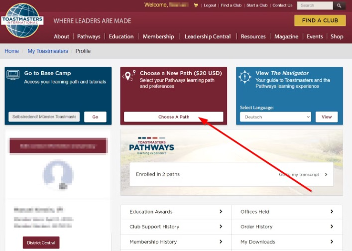

Wie im jüngsten Brief des Internationalen Präsidenten Richard Peck, DTM, (siehe unten) beschrieben, bietet Toastmasters einen GRATIS Pfad in Pathways an.

<!--truncate-->

:::tip

Um Ihren freien Pfad zu erhalten, besuchen Sie bitte Ihr Toastmasters-Profil, klicken Sie auf die Schaltfläche "Choose A Path" und folgen Sie dem normalen Pfadauswahlprozess, um Ihren freien Pfad vor dem 31. März 2021 einzulösen.

Hier findest Du Antworten auf häufig gestellte Fragen zu diesem kostenlosen Pfad. (Quelle: https://www.toastmasters.org/education/free-path-faq)
